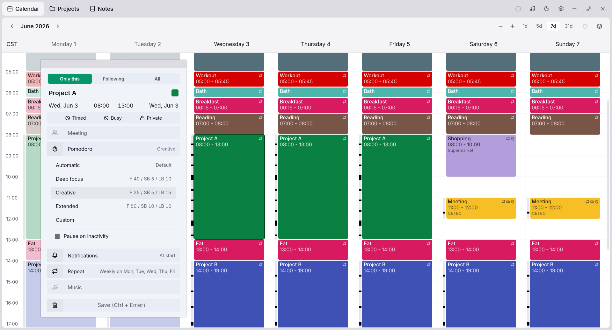
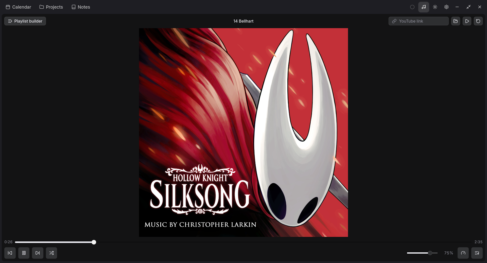

<div align="center">
  
  <h1>Ganbaru AI</h1>

Anti-procrastination + anti-burnout productivity app.

Free, local, open-source, privacy-first, lightweight with opt-in AI.

</div>

<p align="center">
  <a href="#download">Download</a>&nbsp;&nbsp;&nbsp;&nbsp;
  <a href="#features">Features</a>&nbsp;&nbsp;&nbsp;&nbsp;
  <a href="#building-from-source">Building from source</a>&nbsp;&nbsp;&nbsp;&nbsp;
  <a href="#contributing">Contributing</a>&nbsp;&nbsp;&nbsp;&nbsp;
  <a href="#license">License</a>&nbsp;&nbsp;&nbsp;&nbsp;
  <a href="#funding">Funding</a>&nbsp;&nbsp;&nbsp;&nbsp;
  <a href="#acknowledgments">Acknowledgments</a>
</p>

<p align="center">
  
</p>

<p align="center">
  
</p>

> [!WARNING]
> The app is under heavy development and is unstable.

## Download

Download the latest release from [GitHub Releases](https://github.com/opengrimoire/ganbaru-ai/releases/latest).

| Platform | Download |
|---|---|
| **Ubuntu, Debian, Linux Mint** | `.deb` package |
| **Fedora, RHEL, openSUSE** | `.rpm` package |
| **Other Linux x64 desktops** | `.AppImage` |
| **Windows 10 or Windows 11 x64** | `.msi` installer, or the `.exe` setup if preferred |
| **macOS** | Not available yet. macOS builds are planned, but they need Apple hardware and signing before release. |
| **Android** | Not available yet. Android support is planned soon after the current desktop release path settles. |
| **iOS** | Not available yet. iOS depends on the same Apple build and signing path as macOS. |

Use `SHA256SUMS` if you want to verify a download before installing it. The `.sig` files and `latest.json` are used by the updater.

## Features

| Feature | Description | Status |
|---|---|---|
| **Calendar** | 100% custom-built with Svelte 5. Session blocks with drag-and-drop creation/resizing, day/week/month views, full RFC 5545 RRULE recurrence, auto-environment activation on block start | Available |
| **Pomodoro timer** | Focus/break phases, configurable cycle durations, timeline rail visualization, idle detection, suspend/wake handling, pre-break notifications | Available |
| **Kanban board** | Backlog/planned/in-progress/done columns, priority tiers (easy/medium/hard/epic), estimated pomodoro count, task-to-session linking | Planned |
| **Note-taking** | Tiptap block editor with slash commands, markdown storage on disk, bidirectional backlinks indexed in SQLite | Planned |
| **Daily diary** | Morning and evening entry forms, mood/energy/sleep tracking, personal baselines for AI suggestions | Planned |
| **Doomscrolling** | Chromium-based development extension that blocks configured websites and category stacks during selected Pomodoro phases; desktop app blocking includes a blocklist, an on-demand app picker, and automatic Linux app closing, while Firefox, richer rules, and mobile app-level blocking are planned | Early desktop slice |
| **Work environments** | Saved configs per session block: apps to open/close, browser tabs, playlist, blocker rules. Auto-activated by the calendar | Planned |
| **Edge panel** | Always-on-top sidebar with live pomodoro timer, quick-add tasks, music controls, active environment name | Planned |
| **Music player** | Local file playback (Symphonia/FFmpeg), YouTube via IFrame API, playlists tied to session blocks and environments | Available |
| **AI panel** | Embedded terminal (xterm.js) for Codex or another CLI coding agent, BYOK chat widget (OpenAI API, OpenAI-compatible providers, Ollama), calendar-driven session switching, context injection from app state | Planned |
| **Project management** | Lifecycle templates (brainstorming, evaluation, planning, execution), requirement version control, date cascade, report generation | Planned |
| **Sync** | Yjs CRDTs with self-hosted Hocuspocus server, E2E encryption, collaborative workspaces with live presence | Planned |
| **Mobile** | Tauri v2 Android and iOS builds, sleep alarm with diary integration, notification-based pomodoro | Planned |
| **Gamification** | Skill tree, XP system, Will metrics, self-imposed contracts, NPC-guided project workflows | Planned |

See [docs/ROADMAP.md](docs/ROADMAP.md) for the full phased development plan.

## Building from source

### Prerequisites

- [Node.js](https://nodejs.org/) 24 LTS recommended. Node 22.12.0 or newer is also supported while Node 22 remains maintained.
- [Corepack](https://nodejs.org/api/corepack.html) enabled for the pinned [pnpm](https://pnpm.io/) 11 version in `package.json`
- [Rust](https://rustup.rs/) (stable)
- Tauri v2 system dependencies for your platform: [v2.tauri.app/start/prerequisites](https://v2.tauri.app/start/prerequisites/)

### Setup

```bash
git clone https://github.com/opengrimoire/ganbaru-ai.git
cd ganbaru-ai
corepack enable
pnpm install
```

### Development

```bash
cd apps/client
pnpm tauri dev              # desktop app with hot reload
pnpm tauri android dev      # Android (planned)
pnpm tauri ios dev          # iOS (planned)
```

### Browser extension local testing

The Doomscrolling extension is tested as an unpacked Chromium extension during development. The same flow applies to Chrome, Chromium, Brave, and Edge. The browser-specific parts are the extensions page URL and the last argument passed to the native host registration script.

From the repo root, build the native messaging host and generate the dev extension folder:

```bash
pnpm -w run setup:chromium-extension
```

Open the browser's extensions page, enable developer mode, load `extensions/chrome` as the normal unpacked extension, copy the extension id, then register the native host:

```bash
node apps/client/scripts/install-chrome-native-host.mjs <extension-id> <chrome|chromium|brave|edge> app
```

To test the extension against `pnpm tauri dev` while keeping the normal extension connected, load the generated `extensions/chrome-dev` folder as a second unpacked extension, copy its extension id, then register the dev host:

```bash
node apps/client/scripts/install-chrome-native-host.mjs <dev-extension-id> <chrome|chromium|brave|edge> dev
```

After first setup, keep `pnpm tauri dev` running, configure Settings > Doomscrolling > Browser in the app, keep Blacklist mode selected, start a Pomodoro focus session, and open a blocked website such as `reddit.com`.

For repeat testing:

- App UI changes usually hot reload through `pnpm tauri dev`.
- Rust command changes need `pnpm tauri dev` restarted.
- Native host changes need `pnpm -w run build:native-host`.
- Extension HTML, CSS, JS, manifest, or icon changes need the reload button on the extension card in the browser's extensions page.
- Doomscrolling mode, category, or website list changes are picked up by already open browser tabs on the next extension state poll.
- Removing and adding the unpacked extension gives it a new id, so the native host registration command must be run again.

### Build

```bash
cd apps/client
pnpm tauri build            # produces platform-specific installer
```

### Tests

```bash
pnpm -w run check      # types, Svelte diagnostics, Rust formatting, and clippy
pnpm -w run test       # Vitest and cargo tests
pnpm -w run validate   # full local validation gate
pnpm --dir apps/client test:watch
```

## Contributing

Contributions are welcome, but keep in mind:

- The app is in heavy early development. Architecture, APIs, and data models are still changing.
- Active testing is limited to **Ubuntu Linux** and **Windows 10**. macOS and iOS builds are untested since no Apple hardware is available for development, so contributions for those platforms are especially valuable.
- If you are considering a large change, open an issue first to discuss the approach.
- Before contributing, read [CONTRIBUTING.md](CONTRIBUTING.md).
- Participation in project spaces is governed by the [code of conduct](.github/CODE_OF_CONDUCT.md).
- Please report security vulnerabilities privately through the process in [SECURITY.md](.github/SECURITY.md), not through public issues.

## License

Ganbaru AI is licensed under [AGPL-3.0](LICENSE). It's free and open source. You can use, modify, share, and sell Ganbaru AI. If you distribute or host a modified version, you must provide the source code and license that version under AGPL 3.0. Patent rights from contributors are included. The app is provided without warranty, and authors are not liable for damages.

## Funding

Ganbaru AI is donation-funded. Sponsorship will be set up after a minimum stable version is ready for Linux, Windows, and Android.

## Acknowledgments

### Sound effects

Sound effects live in `apps/client/static/sfx/`. App assets are stored as 48 kHz stereo 16-bit PCM WAV files and are sourced from [Freesound](https://freesound.org/) under Attribution 4.0 and CC0 licenses. See `docs/features/app-sounds.md` for the asset format and playback rules.

<table>
  <thead>
    <tr>
      <th>App use</th>
      <th>Filename</th>
      <th>Source sound</th>
      <th>Author</th>
      <th>License</th>
    </tr>
  </thead>
  <tbody>
    <tr>
      <td>Event notification</td>
      <td><code>event-notification.wav</code></td>
      <td><a href="https://freesound.org/people/FunWithSound/sounds/456965/">Short Success Sound Glockenspiel Treasure Video Game.mp3</a></td>
      <td><a href="https://freesound.org/people/FunWithSound/">FunWithSound</a></td>
      <td>Creative Commons 0</td>
    </tr>
    <tr>
      <td>Idle alert</td>
      <td><code>idle-alert.wav</code></td>
      <td><a href="https://freesound.org/people/CogFireStudios/sounds/619837/">Soft Short App Melody</a></td>
      <td><a href="https://freesound.org/people/CogFireStudios/">CogFireStudios</a></td>
      <td>Creative Commons 0</td>
    </tr>
    <tr>
      <td>Focus failure after long idle</td>
      <td><code>focus-session-failed-long-idle.wav</code></td>
      <td><a href="https://freesound.org/people/SilverIllusionist/sounds/562103/">Game Over 8 (One wrong step) .aif</a></td>
      <td><a href="https://freesound.org/people/SilverIllusionist/">SilverIllusionist</a></td>
      <td>Attribution 4.0</td>
    </tr>
    <tr>
      <td>One minute before break</td>
      <td><code>focus-ending-warning.wav</code></td>
      <td><a href="https://freesound.org/people/MATUSTRM/sounds/848972/">sfx_rpg_ui_focus</a></td>
      <td><a href="https://freesound.org/people/MATUSTRM/">MATUSTRM</a></td>
      <td>Creative Commons 0</td>
    </tr>
    <tr>
      <td>Break start</td>
      <td><code>break-start.wav</code></td>
      <td><a href="https://freesound.org/people/rhodesmas/sounds/322930/">Success 03</a></td>
      <td><a href="https://freesound.org/people/rhodesmas/">rhodesmas</a></td>
      <td>Attribution 4.0</td>
    </tr>
    <tr>
      <td>Break finish</td>
      <td><code>break-finished.wav</code></td>
      <td><a href="https://freesound.org/people/CogFireStudios/sounds/619838/">Achievement Happy Beeps Jingle</a></td>
      <td><a href="https://freesound.org/people/CogFireStudios/">CogFireStudios</a></td>
      <td>Attribution 4.0</td>
    </tr>
    <tr>
      <td>Event finish</td>
      <td><code>event-finished.wav</code></td>
      <td><a href="https://freesound.org/people/SilverIllusionist/sounds/843310/">Reflective Guitar Chords #1</a></td>
      <td><a href="https://freesound.org/people/SilverIllusionist/">SilverIllusionist</a></td>
      <td>Creative Commons 0</td>
    </tr>
    <tr>
      <td>Day completed!</td>
      <td><code>pomodoro-day-complete.wav</code></td>
      <td><a href="https://freesound.org/people/SilverIllusionist/sounds/669323/">Victory Fanfare (Light Wills Ever) no drums</a></td>
      <td><a href="https://freesound.org/people/SilverIllusionist/">SilverIllusionist</a></td>
      <td>Attribution 4.0</td>
    </tr>
    <tr>
      <td>Workweek completed!</td>
      <td><code>pomodoro-workweek-complete.wav</code></td>
      <td><a href="https://freesound.org/people/SilverIllusionist/sounds/659751/">Victory Fanfare (RPG or High Fantasy)</a></td>
      <td><a href="https://freesound.org/people/SilverIllusionist/">SilverIllusionist</a></td>
      <td>Attribution 4.0</td>
    </tr>
    <tr>
      <td>AI response finished</td>
      <td><code>ai-response-finished.wav</code></td>
      <td><a href="https://freesound.org/people/eqylizer/sounds/624599/">Three-Note Doorbell or Notification</a></td>
      <td><a href="https://freesound.org/people/eqylizer/">eqylizer</a></td>
      <td>Creative Commons 0</td>
    </tr>
  </tbody>
</table>
