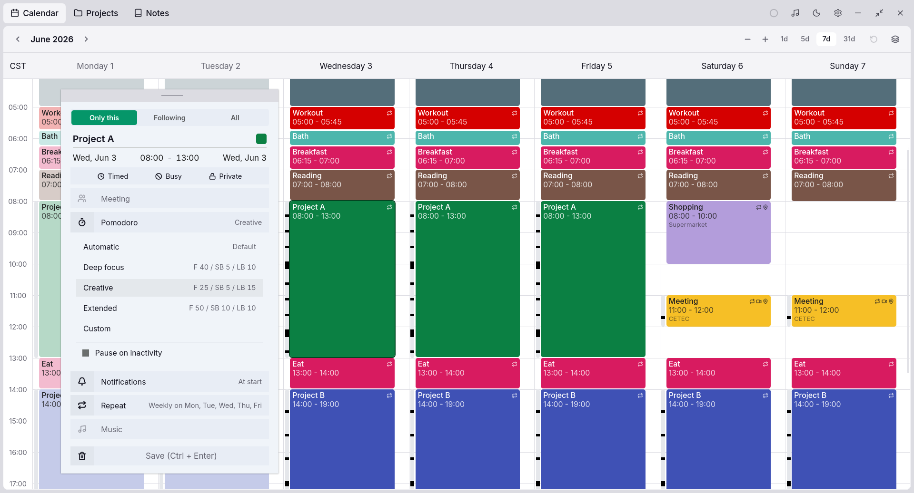
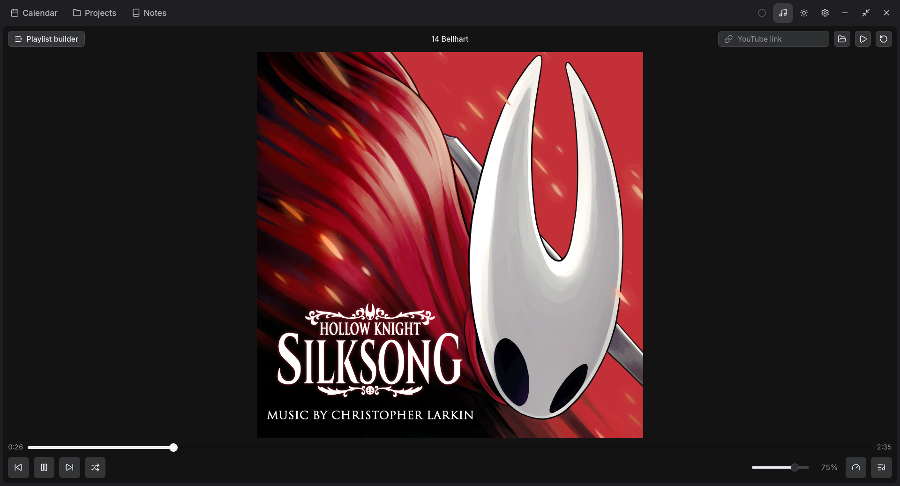

<div align="center">
  
  <h1>Ganbaru AI</h1>

Anti-procrastination + anti-burnout productivity app.

Free, local, open-source, privacy-first, lightweight with opt-in AI.

</div>

<p align="center">
  <a href="#download">Download</a>&nbsp;&nbsp;&nbsp;&nbsp;
  <a href="#features">Features</a>&nbsp;&nbsp;&nbsp;&nbsp;
  <a href="docs/README.md">Documentation</a>&nbsp;&nbsp;&nbsp;&nbsp;
  <a href="#building-from-source">Building from source</a>&nbsp;&nbsp;&nbsp;&nbsp;
  <a href="#contributing">Contributing</a>&nbsp;&nbsp;&nbsp;&nbsp;
  <a href="#license">License</a>&nbsp;&nbsp;&nbsp;&nbsp;
  <a href="#funding">Funding</a>&nbsp;&nbsp;&nbsp;&nbsp;
  <a href="#acknowledgments">Acknowledgments</a>
</p>

<p align="center">
  
</p>

<p align="center">
  
</p>

> [!WARNING]
> The app is under heavy development and is unstable.

## Download

Download the latest release from [GitHub Releases](https://github.com/opengrimoire/ganbaru-ai/releases/latest).

| Platform | Download |
|---|---|
| **Ubuntu, Debian, Linux Mint** | `.deb` package |
| **Fedora, RHEL, openSUSE** | `.rpm` package |
| **Arch Linux, Manjaro, EndeavourOS, Garuda** | `ganbaru-ai-bin` from the AUR |
| **Other Linux x64 desktops** | `.AppImage` |
| **Windows 10 or Windows 11 x64** | `.msi` installer, or the `.exe` setup if preferred |
| **macOS** | Not available yet. macOS builds are planned, but they need Apple hardware and signing before release. |
| **Android** | Not available yet. A substantial Android implementation exists in source, but release validation and signing are incomplete. |
| **iOS** | Not available yet. iOS depends on the same Apple build and signing path as macOS. |

Arch-based distro users can install with `yay -S ganbaru-ai-bin` or another AUR helper.

Use `SHA256SUMS` if you want to check that your downloaded installer matches the checksum published with this release. The `.sig` files and `latest.json` are used by Ganbaru AI's built-in updater, not files you need to download.

## Features

These statuses describe the current repository head. The latest published release can lag behind them.

| Feature | Description | Status |
|---|---|---|
| **Calendar** | Day, week, and month planning; event editing; recurrence; iCalendar transfer; notifications; and project links | Partial |
| **Pomodoro** | Configurable focus rhythms, persisted runs, progress displays, idle and suspend handling, and platform scheduling | Partial |
| **Projects** | SQLite-backed tasks, planning views, dependencies, tags, custom fields, templates, scheduling, and history | Partial |
| **Notes** | SQLite-backed pages, blocks, databases, templates, links, comments, assets, history, and transfer workflows | Partial |
| **Quick notes** | Lightweight rich-text capture with search, colors, and synchronized windows | Implemented |
| **Chat** | Durable project channels with optional local Codex, Claude, Cursor, Grok, and OpenCode sessions, workspace tools, terminals, checkpoints, and review | Partial |
| **Doomscrolling** | Chromium website blocking through a registered local host, desktop application blocking, and consent-based selected-application enforcement on Android | Partial |
| **Music** | Local libraries and playlists, desktop and Android playback, platform media controls, assignments, and YouTube integration | Partial |
| **Themes and localization** | Custom themes plus typed English and Spanish interface catalogs | Partial |
| **Android** | Adaptive Calendar, Projects, Notes, Chat, Pomodoro, Music, Settings, backup, notifications, and Doomscrolling surfaces | Pre-release |
| **Diary, sleep, and work environments** | Missing parts of the planned anti-burnout and context-preparation loop | Planned |
| **Sync and BYOK assistants** | User-provisioned collaboration, external assistants, and explicit external access | Planned |
| **Gamification** | Ethical progress systems that protect recovery and avoid paid chance mechanics | Deferred |

See the [documentation index](docs/README.md), [feature index](docs/features/README.md), and [roadmap](docs/ROADMAP.md) for detailed status and product direction.

## Building from source

### Prerequisites

- [Node.js](https://nodejs.org/) 24 LTS recommended. Node 22.12.0 or newer is also supported while Node 22 remains maintained.
- [Corepack](https://nodejs.org/api/corepack.html) enabled for the pinned [pnpm](https://pnpm.io/) 11 version in `package.json`
- [Rust](https://rustup.rs/) via rustup, using the toolchain pinned in [rust-toolchain.toml](rust-toolchain.toml) (edition 2024)
- Tauri v2 system dependencies for your platform: [v2.tauri.app/start/prerequisites](https://v2.tauri.app/start/prerequisites/)

### Setup

```bash
git clone https://github.com/opengrimoire/ganbaru-ai.git
cd ganbaru-ai
corepack enable
pnpm install
```

### Development

```bash
pnpm --dir apps/client run tauri dev
```

### Android development on a physical device

Android development requires [Tauri's mobile prerequisites](https://v2.tauri.app/start/prerequisites/#android), Android Studio or an equivalent SDK installation, and JDK 21. Install Android SDK Platform 36, Platform Tools, Build Tools 35.0.0, Command-line Tools, and NDK 30.0.15729638. Set `ANDROID_HOME` and `NDK_HOME`, and make `adb` from Platform Tools available on `PATH`. The repository wrapper resolves JDK 21 through `GANBARU_AI_ANDROID_JAVA_HOME`, `JAVA_HOME`, or a supported system installation.

For the usual ARM64 physical-device workflow, install the Rust target once:

```bash
rustup target add aarch64-linux-android
```

Use an Android 10 or newer device and a data-capable USB cable. Enable Developer options and USB debugging, connect the device, unlock it, and approve the computer's debugging key. See Android's [hardware-device guide](https://developer.android.com/studio/run/device) for operating-system-specific USB setup.

Confirm that ADB reports the device with the state `device`, not `unauthorized` or `offline`:

```bash
adb devices
```

Then run from the repository root:

```bash
pnpm --dir apps/client run tauri android dev --host 127.0.0.1
```

This installs the separate `.dev` application identity and keeps the frontend development server on the USB and ADB loopback path instead of exposing it to the local network. Keep the terminal running for logs and hot reload. Native Rust or Android changes may trigger a rebuild and reinstall.

For an ordinary contribution, test the changed flow on the physical device, including Android Back, background and resume, rotation or responsive layout, and relevant permission denial or recovery. A debug launch is not release acceptance. Use the complete [Android testing matrix](docs/testing/android.md) for lifecycle, storage, notifications, media, Doomscrolling, artifact, and release validation.

### Browser extension local testing

The Doomscrolling extension is tested as an unpacked Chromium extension during development. The registration helper below supports Linux and macOS and applies to Chrome, Chromium, Brave, and Edge. It does not create the native-host manifest and registry key required on Windows, so Windows registration remains a manual tooling gap.

From the repo root, build the native messaging host and generate the dev extension folder:

```bash
pnpm -w run setup:chromium-extension
```

Open the browser's extensions page, enable developer mode, load `extensions/chrome` as the normal unpacked extension, copy the extension id, then register the native host:

```bash
node apps/client/scripts/install-chrome-native-host.mjs <extension-id> <chrome|chromium|brave|edge> app
```

To test the extension against `pnpm tauri dev` while keeping the normal extension connected, load the generated `extensions/chrome-dev` folder as a second unpacked extension, copy its extension id, then register the dev host:

```bash
node apps/client/scripts/install-chrome-native-host.mjs <dev-extension-id> <chrome|chromium|brave|edge> dev
```

After first setup, keep `pnpm tauri dev` running, configure Settings > Doomscrolling > Browser in the app, keep Blacklist mode selected, start a Pomodoro focus session, and open a blocked website such as `reddit.com`.

For repeat testing:

- App UI changes usually hot reload through `pnpm tauri dev`.
- Rust command changes need `pnpm tauri dev` restarted.
- Native host changes need `pnpm -w run build:native-host`.
- Extension HTML, CSS, JS, manifest, or icon changes need the reload button on the extension card in the browser's extensions page.
- Doomscrolling mode, category, or website list changes are picked up by already open browser tabs on the next extension state poll.
- Removing and adding the unpacked extension gives it a new id, so the native host registration command must be run again.

### Build

```bash
cd apps/client
pnpm tauri build            # produces platform-specific installer
```

### Tests

```bash
pnpm -w run check      # types, Svelte diagnostics, Rust formatting, and clippy
pnpm -w run test       # Vitest and cargo tests
pnpm -w run validate   # full local validation gate
pnpm --dir apps/client test:watch
```

## Contributing

Contributions are welcome, but keep in mind:

- The app is in heavy early development. Architecture, APIs, and data models are still changing.
- Primary desktop testing uses **Ubuntu Linux** and **Windows 10**, with Android physical-device validation in progress. macOS and iOS builds remain untested because Apple build hardware and signing are not available.
- If you are considering a large change, open an issue first to discuss the approach.
- Before contributing, read [CONTRIBUTING.md](CONTRIBUTING.md).
- Participation in project spaces is governed by the [code of conduct](.github/CODE_OF_CONDUCT.md).
- Please report security vulnerabilities privately through the process in [SECURITY.md](.github/SECURITY.md), not through public issues.

## License

Ganbaru AI is licensed under [AGPL-3.0](LICENSE). It's free and open source. You can use, modify, share, and sell Ganbaru AI. If you distribute or host a modified version, you must provide the source code and license that version under AGPL 3.0. Patent rights from contributors are included. The app is provided without warranty, and authors are not liable for damages.

## Funding

Ganbaru AI is donation-funded. Sponsorship will be set up after a minimum stable version is ready for Linux, Windows, and Android.

## Acknowledgments

### Sound effects

Sound effects live in `apps/client/static/sfx/`. App assets are stored as 48 kHz stereo 16-bit PCM WAV files and are sourced from [Freesound](https://freesound.org/) under Attribution 4.0 and CC0 licenses. See [audio assets](docs/development/audio-assets.md) for the asset format and playback rules.

<table>
  <thead>
    <tr>
      <th>App use</th>
      <th>Filename</th>
      <th>Source</th>
      <th>Author</th>
      <th>License</th>
    </tr>
  </thead>
  <tbody>
    <tr>
      <td>Event notification</td>
      <td><code>event-notification.wav</code></td>
      <td><a href="https://freesound.org/people/FunWithSound/sounds/456965/">Short Success Sound Glockenspiel Treasure Video Game.mp3</a></td>
      <td><a href="https://freesound.org/people/FunWithSound/">FunWithSound</a></td>
      <td>Creative Commons 0</td>
    </tr>
    <tr>
      <td>Idle alert</td>
      <td><code>idle-alert.wav</code></td>
      <td><a href="https://freesound.org/people/CogFireStudios/sounds/619837/">Soft Short App Melody</a></td>
      <td><a href="https://freesound.org/people/CogFireStudios/">CogFireStudios</a></td>
      <td>Creative Commons 0</td>
    </tr>
    <tr>
      <td>Focus failure after long idle</td>
      <td><code>focus-session-failed-long-idle.wav</code></td>
      <td><a href="https://freesound.org/people/SilverIllusionist/sounds/562103/">Game Over 8 (One wrong step) .aif</a></td>
      <td><a href="https://freesound.org/people/SilverIllusionist/">SilverIllusionist</a></td>
      <td>Attribution 4.0</td>
    </tr>
    <tr>
      <td>One minute before break</td>
      <td><code>focus-ending-warning.wav</code></td>
      <td><a href="https://freesound.org/people/MATUSTRM/sounds/848972/">sfx_rpg_ui_focus</a></td>
      <td><a href="https://freesound.org/people/MATUSTRM/">MATUSTRM</a></td>
      <td>Creative Commons 0</td>
    </tr>
    <tr>
      <td>Break start</td>
      <td><code>break-start.wav</code></td>
      <td><a href="https://freesound.org/people/rhodesmas/sounds/322930/">Success 03</a></td>
      <td><a href="https://freesound.org/people/rhodesmas/">rhodesmas</a></td>
      <td>Attribution 4.0</td>
    </tr>
    <tr>
      <td>Break finish</td>
      <td><code>break-finished.wav</code></td>
      <td><a href="https://freesound.org/people/CogFireStudios/sounds/619838/">Achievement Happy Beeps Jingle</a></td>
      <td><a href="https://freesound.org/people/CogFireStudios/">CogFireStudios</a></td>
      <td>Attribution 4.0</td>
    </tr>
    <tr>
      <td>Event finish</td>
      <td><code>event-finished.wav</code></td>
      <td><a href="https://freesound.org/people/SilverIllusionist/sounds/843310/">Reflective Guitar Chords #1</a></td>
      <td><a href="https://freesound.org/people/SilverIllusionist/">SilverIllusionist</a></td>
      <td>Creative Commons 0</td>
    </tr>
    <tr>
      <td>Day completed!</td>
      <td><code>pomodoro-day-complete.wav</code></td>
      <td><a href="https://freesound.org/people/SilverIllusionist/sounds/669323/">Victory Fanfare (Light Wills Ever) no drums</a></td>
      <td><a href="https://freesound.org/people/SilverIllusionist/">SilverIllusionist</a></td>
      <td>Attribution 4.0</td>
    </tr>
    <tr>
      <td>Workweek completed!</td>
      <td><code>pomodoro-workweek-complete.wav</code></td>
      <td><a href="https://freesound.org/people/SilverIllusionist/sounds/659751/">Victory Fanfare (RPG or High Fantasy)</a></td>
      <td><a href="https://freesound.org/people/SilverIllusionist/">SilverIllusionist</a></td>
      <td>Attribution 4.0</td>
    </tr>
    <tr>
      <td>AI response finished</td>
      <td><code>ai-response-finished.wav</code></td>
      <td><a href="https://freesound.org/people/eqylizer/sounds/624599/">Three-Note Doorbell or Notification</a></td>
      <td><a href="https://freesound.org/people/eqylizer/">eqylizer</a></td>
      <td>Creative Commons 0</td>
    </tr>
  </tbody>
</table>

### File icons

| App use | Source | Author | License |
|---|---|---|---|
| Chat file icons | [vscode-icons](https://github.com/vscode-icons/vscode-icons) | Roberto Huertas | [MIT](apps/client/static/file-icons/vscode-icons-LICENSE.txt) |
